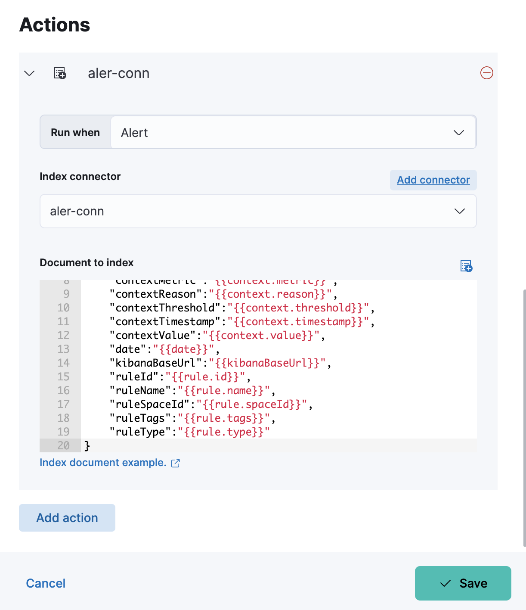
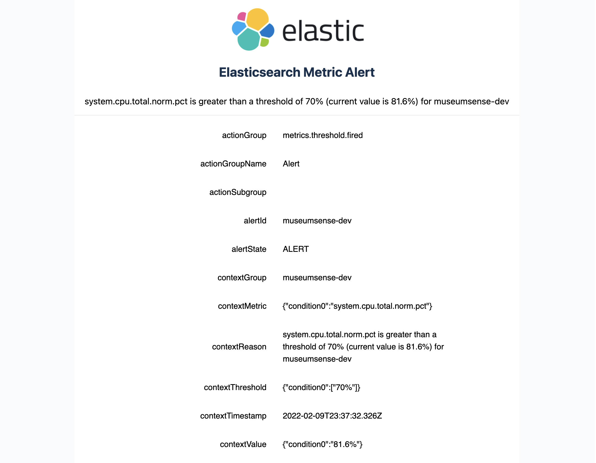

## Elasticsearch Email Alerts

It is developed to deliver email alerts for the elastic stack version 7.17. Elasticsearch alerts does not provide email actions but only index and log actions.
Index action can be used to write alert details to an index as a document and this tool listens for the changes on an index and sends the details via email. Index action can be configured with the following fields:

```json

{
    "actionGroup": "{{alert.actionGroup}}",
    "actionGroupName":"{{alert.actionGroupName}}",
    "actionSubgroup":"{{alert.actionSubgroup}}",
    "alertId":"{{alert.id}}",
    "alertState":"{{context.alertState}}",
    "contextGroup":"{{context.group}}",
    "contextMetric":"{{context.metric}}",
    "contextReason":"{{context.reason}}",
    "contextThreshold":"{{context.threshold}}",
    "contextTimestamp":"{{context.timestamp}}",
    "contextValue":"{{context.value}}",
    "date":"{{date}}",
    "kibanaBaseUrl":"{{kibanaBaseUrl}}",
    "ruleId":"{{rule.id}}",
    "ruleName":"{{rule.name}}",
    "ruleSpaceId":"{{rule.spaceId}}",
    "ruleTags":"{{rule.tags}}",
    "ruleType":"{{rule.type}}"
}
```


---

## Configuration Parameters

To run the application, the following parameters are needed to be set in `application.yml` or as an environment variable.
If you want to add as environment variable use capital letter and replace `.` with  `_`, i.e: `elastic.host` -> `ELASTIC_HOST` 

##### Elasticsearch config
- **elastic.host**: Elasticsearch host
- **elastic.port**: Elasticsearch port
- **elastic.username**: Username to authenticate elasticsearch
- **elastic.password**: Password to authenticate elasticsearch
- **elastic.alertIndexName**: The name of the index used in alert action for writing the alert documents

##### Email config
- **email.host**: Email host
- **email.port**: Email port
- **email.username**: Email username to authenticate (Also used as sender)
- **email.password**: Email password to authenticate
- **email.to**: Email address for sending email to
- **email.subject**: Email subject
- **email.cc**: Comma separated email address list

---

## Example Email



[comment]: <> (- [Micronaut HTTP Client documentation]&#40;https://docs.micronaut.io/latest/guide/index.html#httpClient&#41;)

